# Schema de Base de Donnees - Roxane

## Diagramme des relations

```mermaid
erDiagram
    users ||--o{ members : "a des membres"
    users ||--o{ memberships : "cree (admin)"
    users ||--o{ sessions : "a des sessions"

    members }o--o| users : "lie a"
    members }o--o| member_groups : "dans le groupe"
    members ||--o{ memberships : "a des adhesions"
    members ||--o{ ispconfigs_members : "comptes ISPConfig"
    members ||--o{ nextclouds_members : "comptes Nextcloud"

    memberships }o--|| members : "pour le membre"
    memberships }o--|| packages : "formule choisie"
    memberships }o--o| users : "cree par (admin)"
    memberships ||--o{ services_memberships : "services inclus"

    services ||--o{ services_memberships : "utilise dans"

    member_groups ||--o{ members : "contient"
    packages ||--o{ memberships : "souscrite via"

    roles ||--o{ role_has_permissions : "a des permissions"
    permissions ||--o{ role_has_permissions : "attribuee a"
    roles ||--o{ model_has_roles : "attribue a"
    permissions ||--o{ model_has_permissions : "attribuee a"

    users {
        bigint id PK
        string name "NOT NULL"
        string email UK "NOT NULL"
        timestamp email_verified_at "nullable"
        string password "NOT NULL"
        text two_factor_secret "nullable (Fortify)"
        text two_factor_recovery_codes "nullable (Fortify)"
        timestamp two_factor_confirmed_at "nullable (Fortify)"
        string remember_token "nullable"
        timestamp created_at
        timestamp updated_at
    }

    password_reset_tokens {
        string email PK
        string token "NOT NULL"
        timestamp created_at "nullable"
    }

    sessions {
        string id PK
        bigint user_id FK "nullable, indexed"
        string ip_address "nullable, max 45"
        text user_agent "nullable"
        longtext payload "NOT NULL"
        integer last_activity "indexed"
    }

    contacts {
        bigint id PK
        string lastname "nullable"
        string firstname "nullable"
        string email "nullable"
        string address "nullable"
        string subject "nullable"
        text message "nullable"
        timestamp created_at
        timestamp updated_at
    }

    member_groups {
        bigint id PK
        string identifier UK "NOT NULL"
        string name "NOT NULL"
        string description "nullable"
        timestamp created_at
        timestamp updated_at
        timestamp deleted_at "soft delete"
    }

    member_types {
        bigint id PK
        string identifier UK "NOT NULL"
        string name "NOT NULL"
        string description "nullable"
        timestamp created_at
        timestamp updated_at
        timestamp deleted_at "soft delete"
    }

    packages {
        bigint id PK
        string identifier UK "NOT NULL"
        string name "NOT NULL"
        string description "nullable"
        decimal price "precision 10, default 0"
        boolean is_active "default true"
        timestamp created_at
        timestamp updated_at
        timestamp deleted_at "soft delete"
    }

    services {
        bigint id PK
        string identifier UK "NOT NULL"
        string name "NOT NULL"
        string description "nullable"
        string url "NOT NULL"
        string icon "nullable"
        timestamp created_at
        timestamp updated_at
        timestamp deleted_at "soft delete"
    }

    members {
        bigint id PK
        bigint user_id FK "nullable, ON DELETE SET NULL"
        string dolibarr_id "nullable"
        string keycloak_id "nullable"
        enum status "draft|valid|pending|cancelled|excluded, default draft"
        enum nature "physical|legal, default physical"
        bigint type_id "nullable"
        bigint group_id "nullable"
        string lastname "nullable"
        string firstname "nullable"
        string email "NOT NULL"
        string retzien_email "nullable"
        string company "nullable"
        date date_of_birth "nullable"
        string address "nullable"
        string zipcode "nullable"
        string city "nullable"
        string country "nullable"
        string phone1 "nullable"
        string phone2 "nullable"
        boolean public_membership "default false"
        string website_url "nullable"
        timestamp created_at
        timestamp updated_at
        timestamp deleted_at "soft delete"
    }

    memberships {
        bigint id PK
        bigint member_id FK "NOT NULL, ON DELETE CASCADE"
        bigint admin_id FK "nullable, ON DELETE SET NULL"
        bigint package_id FK "NOT NULL, ON DELETE CASCADE"
        date start_date "nullable"
        date end_date "nullable"
        enum status "active|expired|pending, default pending"
        date validation_date "nullable"
        string payment_method "nullable"
        decimal amount "precision 10-2, default 0"
        enum payment_status "paid|unpaid|partial, default unpaid"
        longtext note_public "nullable"
        longtext note_private "nullable"
        string dolibarr_id "nullable"
        string dolibarr_user_id "nullable"
        timestamp created_at
        timestamp updated_at
        timestamp deleted_at "soft delete"
    }

    services_memberships {
        bigint id PK
        bigint service_id FK "NOT NULL, ON DELETE CASCADE"
        bigint membership_id FK "NOT NULL, ON DELETE CASCADE"
        timestamp created_at
        timestamp updated_at
    }

    ispconfigs_members {
        bigint id PK
        bigint member_id FK "NOT NULL, ON DELETE NO ACTION"
        string ispconfig_client_id "nullable"
        string ispconfig_service_user_id "nullable"
        string email "nullable"
        enum type "mail|web|other, NOT NULL"
        json data "nullable"
        timestamp created_at
        timestamp updated_at
    }

    nextclouds_members {
        bigint id PK
        bigint member_id FK "NOT NULL, ON DELETE NO ACTION"
        string nextcloud_user_id "nullable"
        json data "nullable"
        timestamp created_at
        timestamp updated_at
    }

    webdomains_members {
        bigint id PK
        timestamp created_at
        timestamp updated_at
    }

    permissions {
        bigint id PK
        string name "NOT NULL"
        string guard_name "NOT NULL"
        timestamp created_at
        timestamp updated_at
    }

    roles {
        bigint id PK
        string name "NOT NULL"
        string guard_name "NOT NULL"
        timestamp created_at
        timestamp updated_at
    }

    model_has_permissions {
        bigint permission_id FK "NOT NULL"
        string model_type "NOT NULL"
        bigint model_id "NOT NULL"
    }

    model_has_roles {
        bigint role_id FK "NOT NULL"
        string model_type "NOT NULL"
        bigint model_id "NOT NULL"
    }

    role_has_permissions {
        bigint permission_id FK "NOT NULL"
        bigint role_id FK "NOT NULL"
    }

    cache {
        string key PK
        mediumtext value "NOT NULL"
        integer expiration "NOT NULL"
    }

    cache_locks {
        string key PK
        string owner "NOT NULL"
        integer expiration "NOT NULL"
    }

    jobs {
        bigint id PK
        string queue "indexed"
        longtext payload "NOT NULL"
        tinyint attempts "NOT NULL"
        integer reserved_at "nullable"
        integer available_at "NOT NULL"
        integer created_at "NOT NULL"
    }

    job_batches {
        string id PK
        string name "NOT NULL"
        integer total_jobs "NOT NULL"
        integer pending_jobs "NOT NULL"
        integer failed_jobs "NOT NULL"
        longtext failed_job_ids "NOT NULL"
        mediumtext options "nullable"
        integer cancelled_at "nullable"
        integer created_at "NOT NULL"
        integer finished_at "nullable"
    }

    failed_jobs {
        bigint id PK
        string uuid UK "NOT NULL"
        text connection "NOT NULL"
        text queue "NOT NULL"
        longtext payload "NOT NULL"
        longtext exception "NOT NULL"
        timestamp failed_at "default CURRENT_TIMESTAMP"
    }
```

## Detail des tables

### Tables metier

| Table | Description | Soft Delete | FK |
|-------|-------------|:-----------:|-----|
| `members` | Adherents de l'association | oui | `user_id` → users, `group_id` → member_groups |
| `memberships` | Cotisations / periodes d'adhesion | oui | `member_id` → members, `admin_id` → users, `package_id` → packages |
| `services_memberships` | Pivot services <-> cotisations | non | `service_id` → services, `membership_id` → memberships |
| `packages` | Formules d'adhesion (custom, 1 an, 2 ans) | oui | - |
| `services` | Services numeriques (mail, nextcloud, etc.) | oui | - |
| `member_groups` | Groupes de membres (admin, website) | oui | - |
| `member_types` | Types de membres | oui | - |
| `contacts` | Soumissions du formulaire de contact | non | - |

### Tables d'integration externe

| Table | Service externe | Description |
|-------|----------------|-------------|
| `ispconfigs_members` | ISPConfig | Lie un membre a ses comptes mail/web ISPConfig |
| `nextclouds_members` | Nextcloud | Lie un membre a son compte Nextcloud |
| `webdomains_members` | ISPConfig Web | Table preparee (vide) |

### Tables systeme

| Table | Origine | Description |
|-------|---------|-------------|
| `users` | Laravel + Fortify | Comptes utilisateurs avec 2FA |
| `password_reset_tokens` | Laravel | Tokens de reinitialisation de mot de passe |
| `sessions` | Laravel | Sessions utilisateur |
| `cache` / `cache_locks` | Laravel | Cache applicatif |
| `jobs` / `job_batches` / `failed_jobs` | Laravel | File d'attente de jobs |
| `permissions` | Spatie | Permissions individuelles |
| `roles` | Spatie | Roles (super_admin, panel_user) |
| `model_has_permissions` | Spatie | Pivot polymorphe modele <-> permissions |
| `model_has_roles` | Spatie | Pivot polymorphe modele <-> roles |
| `role_has_permissions` | Spatie | Pivot roles <-> permissions |

### Enums en base

| Table | Colonne | Valeurs |
|-------|---------|---------|
| `members` | `status` | `draft`, `valid`, `pending`, `cancelled`, `excluded` |
| `members` | `nature` | `physical`, `legal` |
| `memberships` | `status` | `active`, `expired`, `pending` |
| `memberships` | `payment_status` | `paid`, `unpaid`, `partial` |
| `ispconfigs_members` | `type` | `mail`, `web`, `other` |

### Cles etrangeres

| Table source | Colonne | Table cible | ON DELETE |
|-------------|---------|-------------|-----------|
| `members` | `user_id` | `users` | SET NULL |
| `memberships` | `member_id` | `members` | CASCADE |
| `memberships` | `admin_id` | `users` | SET NULL |
| `memberships` | `package_id` | `packages` | CASCADE |
| `services_memberships` | `service_id` | `services` | CASCADE |
| `services_memberships` | `membership_id` | `memberships` | CASCADE |
| `ispconfigs_members` | `member_id` | `members` | NO ACTION |
| `nextclouds_members` | `member_id` | `members` | NO ACTION |
| `sessions` | `user_id` | `users` | - |
| `model_has_permissions` | `permission_id` | `permissions` | CASCADE |
| `model_has_roles` | `role_id` | `roles` | CASCADE |
| `role_has_permissions` | `permission_id` | `permissions` | CASCADE |
| `role_has_permissions` | `role_id` | `roles` | CASCADE |